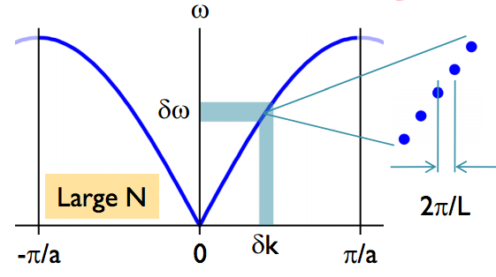

Debye Model
==========================================

.. warning::
   I need to rewrite this section.

Interacting Particles
------------------------

To work out the statistical mechanics of a system, we need the probability distribution of the states or the density of states (DoS). For systems with non-interacting particles, the distribution is determined by the motion of the free particles. For systems with interactions between the composite particles, the dynamics of the particles are coupled.

In this section, we will discuss a 1D system of coupled harmonic oscillators of the same mass :math:`m`. In :numref:`coupled-harmonic-oscillators-demo`, two coupled oscillators are shown. The displacement of the :math:`i`th particle is denoted by :math:`x_i`.

.. _coupled-harmonic-oscillators-demo:
.. figure:: images/Coupled_Harmonic_Oscillator.png
   :align: center

   Coupled harmonic oscillators with two particles.

In general, the equation of motion of a N-particle system is determined by

.. math::
   m \ddot x_i + k( x_i -x_{i-1} + x_i - x_{i+1}) = 0
   :label: eq-2-coupled-harmonic-oscillators-eom

with i goes from :math:`2` to :math:`N-1`, and :math:`k` is the spring constant of the springs. We will have :math:`N-2` equations together with two boundary conditions for the first and the last particle.

This system of second order differential equations is easily solved using Fourier transform. Here we apply the transform :math:`x_q = \sum x_m e^{i m q}` to :eq:`eq-2-coupled-harmonic-oscillators-eom`. This Fourier transform will decouple the equations,

.. math::
   m \ddot x_q + k' x_q =0

The solutions to :math:`x_q` are the normal modes with frequencies :math:`\omega_q ~ \sin|q/2|`. Thus the Debye theory is a theory of many Einstein solutions, i.e.,

.. math::
   C_{\mathrm{Debye}} = \int C_{\mathrm{Einstein}} (\omega) g(\omega) d \omega

In Einstein's model, every particle is identical thus has the same oscillation frequency. However, the Einstein theory is wrong due to the extremely slow rising of the Boltzman factor as shown in :numref:`boltzman_factor_and_low_temperature`.

.. _boltzman_factor_and_low_temperature:

.. figure:: ../_static/voc/boltzfactor.png
   :align: center

   The Boltzman factor and its behavior at low temperature. It has a 'sleeping slope' at very low temperature.

.. admonition:: Calculate the Heat Capacity
   :class: note

   To calculate the heat capacity in Debye's theory, we require the following steps.

   1. Calculate the energy spectrum of :math:`N` coupled particles system using Fourier transform;
   2. Evaluate the heat capacity integral.

The energy spectrum indicates the dispersion relations. The dispersion relations in Debye's model is very different from that of Einstein's model.

.. figure:: images/DebyeModelkSpace.png
   :align: center

   Dispersion relations. (Image taken from `here <http://griffin.ucsc.edu/teaching/08Q1-155/download/Lecture%2006%20-%20Phonon%20Dynamics.pdf>`_ .)

We obtain a simple solution if we apply a linear approximation of the dispersion relation :math:`w= c k`.

   Linear approximation of the dispersion relation. (Image taken from `here <http://griffin.ucsc.edu/teaching/08Q1-155/download/Lecture%2006%20-%20Phonon%20Dynamics.pdf>`_ .)

The density of state is calculated as

.. math::
   g(\omega) = \frac{V \omega^2}{2\pi^2 c^3}

for a 3D lattice.

The average energy becomes

.. math::
   E = \frac{3V}{2\pi^2 c^3 \hbar^3} (k_B T)^4 \int_0^{x(\omega_m)} \frac{x^3}{e^x - 1} d x

while the heat capacity is

.. math::
   C = 9 N k_B \left(\frac{T}{\Theta_D}\right)^3 \int _ 0 ^{x(\omega_m)} \frac{x^4 e^x}{(e^x - 1)^2} d x

where :math:`x(\omega_m) = \Theta_D/ T` and :math:`\Theta_D = \hbar \omega_D/k_B`.

.. note::
   What's amazing about Debye's theory is that the low temperature behavior is independent of cut off frequency. At low temperature, :math:`x(\omega_D)` becomes infinite and it becomes an integration from 0 to infinity thus we do not need to know the cut off temperature to find out the low temperature result and it agrees with experiments very well.

.. important::
   We start for the Einstein's theory and reaches a 'non-sleeping' model. What happened when we integrated over all DoS in Debye model?

   This is because our density of states :math:`g(\omega)\propto \omega^2` at low temperature tells us that we would have more states at a certain energy as :math:`\omega` increases. The system needs more energy to raise the temperature, i.e., the heat capacity line becomes steeper.

.. admonition:: Why is the number of modes important in Debye model?
   :class: important

   The degree of freedom is finite in these systems. If we don't cut off the frequency, we would have infinite degree of freedom because we have made an approximation that dispersion relation is a straight line :math:`\omega = c k` all the time. This would certainly lead to an infinite heat capacity and infinite total energy.

Beyond Debye Model
----------------------

Debye model is simple yet powerful. Generally speaking we can not alway find out the correct transformation that decouples the particles in the equation of motion. The Ising model is a perfect example for this. The Hamiltonian for the Ising model is

.. math::
   H = \sum_i \mu \sigma B - \sum _ {i,j} J^{ij}\sigma_i \sigma _ j

where :math:`J^{ij}` is the coupling constants between the particles. With :math:`J^{ij} = J (  \delta _ i \delta _ {j-1} +\delta _ i \delta _{j+1} )`, we reach our simple model.

.. hint::
   The reason that we can decouple the simple coupled harmonic oscillators system is that the coupling constant are the same for all springs and each harmonic oscillator is identical. The system becomes a homogeneous chain such that the normal modes are sin or cos waves depending on the boundary condition. As the chain becomes inhomogeneous, we can not use simple plain waves as normal modes any more.
