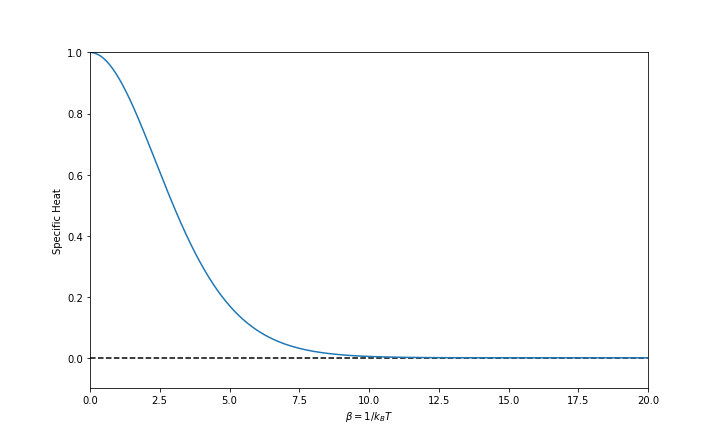

Harmonic Oscillator and Density of States
================================================

Quantum Harmonic Oscillator
----------------------------

As derived in quantum mechanics, quantum harmonic oscillators have the following energy levels,

.. math::
   E_n  = \left(n + \frac{1}{2}\right)\hbar \omega

where :math:`\omega = \sqrt{ k/m }` is the base frequency of the oscillator. The :math:`1/2` is our signature that we are working with quantum systems.

Thus the partition function is easily calculated since it is a simple geometric progression,

.. math::
   Z = \sum_n e^{-\beta E_n} = \frac{e^{-\frac{1}{2} \hbar \omega }} { 1 - e^{- \beta \hbar \omega} } = \frac{1}{2}  \sinh(\beta \hbar \omega/2).

The limiting behavior of the partition function is

.. math::
   \lim_{\beta \to \infty} Z &= e^{-\frac{1}{2} \hbar \omega }, \\
   \lim_{\omega \to \infty} Z &= 0.

The internal energy is derived using the partition function,

.. math::
   \langle E \rangle = -\frac{\partial}{\partial\beta} \ln Z =  \hbar \omega \left( \frac{1}{2} + \frac{1}{\exp(\beta\hbar\omega) - 1} \right)

By definition, the specific heat is the change of internal energy as temperature changes, i.e.,

.. math::
   C = \frac{\partial}{\partial T} \langle E\rangle = k_B (\beta \hbar \omega)^2 \frac{\exp(\beta \hbar \omega)}{ (\exp(\beta \hbar \omega) - 1)^2 }

This specific heat behaves is shown in :numref:`quantum-harmonic-oscillators-specific-heat`.

.. _quantum-harmonic-oscillators-specific-heat:

   Specific heat as a function of :math:`\beta`. We have the Boltzman constant :math:`k_B=1` and the characteristic energy scale :math:`\hbar \omega = 1`.

.. admonition:: Why don't we have infinite specific heat due to infinite energy levels
   :class: note

   Though we have infinite energy levels, the specific heat won't blow up because the probability of a high energy level state is extremely small.

Density of States
-----------------------

.. admonition:: Free Energy and Partition Function
   :class: note

   In thermodynamics, the free energy of a system is given by

   .. math::
      A = U - T S

   In statistical mechanics, the free energy can be derived from the partition function,

   .. math::
      A = - k_B T \ln Z

   In fact, all thermodynamics quantities are solved, as long as we find out partition function. For example, the entropy is

   .. math::
      S = -k_B \beta  \left(T \ln Z - \frac{\partial}{\partial \beta} \ln Z \right)

Specific heat is very different for systems in 1D, 2D, and 3D. We take the dipole system as an example. In 1D, the dipole system has discrete energy levels. However, the energy levels are filling up the gaps in 2D and 3D. Even for 2D and 3D systems, we have different degeneracies.

Generally speaking, the partition function can be expressed using the following integral,

.. math::
   Z = \int g(E) e^{-\beta E}\mathrm d E,

where :math:`g(E)` is the density of states. The density of states tells us about the degeneracies.

.. admonition:: Discussions of Partition Function  -  Lingfei, Qian-yuan, Lei
   :class: discussion

   1. :math:`Z` is an average of :math:`g(E)` under Boltzman distribution;
   2. :math:`Z` is the Laplace transform of :math:`g(E)`.

Calculation of the Density of States
~~~~~~~~~~~~~~~~~~~~~~~~~~~~~~~~~~~~~~~~~~~~~~~~~~~~~~~~~~~~

Here we consider the free quantum particle in a 2D box as an example.

In the momentum (wave number :math:`\mathbf k`) space, all possible states are distributed on a virtual grid as shown in :numref:`particle-in-a-2d-box-dos-cal`.

.. _particle-in-a-2d-box-dos-cal:

.. figure:: images/2DDoS.png
   :align: center

   Quantum particle in a 2D box

For any given energy :math:`E`, we have the relation between the wave number and the energy :math:`k_x^2 + k_y^2 \propto E`. The number of states on an energy shell :math:`E ~ E + \mathrm d E` is determined by the area of it divided by the area of each small box on the virtual grid shown in :numref:`particle-in-a-2d-box-dos-cal`, i.e.,

.. math::
   N = \frac{d V_k}{d V_0} = \frac{2\pi k d k}{\frac{2\pi}{L_x} \frac{2\pi}{L_y} } \equiv g(E) d E.

The DoS :math:`g(E)` is the ratio of the differential number of states divided by the differential energy,

.. math::
   g(E) = \frac{ 2\pi k }{\frac{d E}{d k}} \frac{L_x L_y}{(2\pi)^2}

We can rewrite the expressions,

.. math::
   g(E) = \frac{\text{area of } E ~ d E}{|\nabla_k E|} \frac{\text{volume of the box} }{(2\pi)^d}

where :math:`d` is the dimension of the system or box.

.. admonition:: Dispersion relations and Density of States
   :class: note

   Note that the gradient of energy :math:`\frac{d E}{d k}` gives us the spread out of energy, a.k.a. dispersion relations. Dispersion relations and density of states are tightly related.

To sum up, the quantities that are used to determine the DoS:

* :math:`E(k)`
* :math:`n`: dimension
* :math:`V`: volume of the box (important in QM because this sets the boundary conditions)

Density of States for Some Simple Systems
~~~~~~~~~~~~~~~~~~~~~~~~~~~~~~~~~~~~~~~~~~~~~~~~~~~~~~~~~~~~~~

1. Free particle in a 2D box with length :math:`L`:

   .. math::
      \frac{d E}{d k} = \frac{d}{d k}\left( \frac{\hbar^2 k^2}{2m} \right) = \frac{\hbar^2 k}{m}.

   The density of states is

   .. math::
      g(E) = \frac{2\pi k }{\frac{\hbar^2 k}{m}} \frac{L^2}{(2\pi)^2} = (\frac{1}{2\pi} \frac{m}{\hbar^2})L^2

2. Free particle in a 3D box with length :math:`L`:

   .. math::
      \frac{d E}{d k} = \frac{\hbar^2 k^2}{2m}.

   The density of states is

   .. math::
      g(E) = \frac{m}{\hbar^2} \frac{L^3}{2\pi^2} k

   This is :math:`k` dependent.

3. Free particle in a 1D box with length :math:`L`:

   .. math::
      g(E) = \frac{1}{k} \frac{m L}{2\pi \hbar^2}

.. admonition:: Dimension is Crucial for Density of States
   :class: note

   These results are very different. For 1D system, the higher energy of the system is, the smaller the DoS is. As a comparison, the DoS for 2D systems doesn't depend on the energy. In 3D, the DoS is proportional to the square root of energy.

   The DoS is very important in understanding quantum systems. Quantization can lead to strange DoS. On ther other hand, the DoS is always constant in classical systems without quantizations.

Partition Function and Density of States
--------------------------------------------------------

The thermal wavelength decides the characteristic correlation length in statistical mechanics, which is defined as

.. math::
   \lambda_T = \frac{\hbar}{ \sqrt{ 2\pi m k_B T } }.

The thermal wavelength is a combination of quantum mechanics and thermodynamics. :math:`\sqrt{m k_B T}` has dimension of energy while :math:`\hbar` has dimension of energy * time. In natural units, time is basically length. This is why the quantity serves as a characteristic length.

For a single particle in a 3D box, the partition function is

.. math::
   Z_1 = \frac{V}{\lambda_T^3}.

Recall that the partition function is the average of density of states under the Boltzman distribution and that the thermal length is the characteristic length of the thermal system. We rewrite this formula using words

.. math::
   &\text{density of states} = \text{physical volumne} \text{unit thermal volume} \\
   \Rightarrow & \text{number of states} / \text{energy span} = \text{physical volumne} / \text{unit thermal volume}.

.. admonition:: Thermal Length
   :class: note

   TO BE ADDED.

For a N-particles system without interaction between particles, density of states will be more dense since we have more possible states and degrees of freedom. **In classical mechanics**, the number of states will be full combination of all the single particle states since all the particles are distinguishable. Thus the partition function should be :math:`Z_N  = (Z_1)^N`. The free energy

.. math::
   A = -k_B T \ln (Z_N) = -k_B T N \ln Z_1 = -k_B T N (\ln V - 3\ln \lambda_T)

.. admonition:: Gibbs Mixing Paradox
   :class: warning

   This quantity is neither intensive nor extensive! If we combine two exactly same system, then we won't have twice of the free energy. It's called **Gibbs mixing paradox**.

Phase Space of Quantum Partition Function
------------------------------------------

We will provide a physical vision of the quantum partition function using classical mechanics.

In classical mechanics, the partition function is

.. math::
   Z = \int d^3 x \int d^3 p e^{-\beta p^2/2m} = V \left( \sqrt{\frac{ 2m \pi }{\beta} } \right)^3

We can infer from this that the thermal wave length is :math:`1/\sqrt{\frac{ 2m \pi }{\beta}}`. In quantum mechanics, the partition function is a summation,

.. math::
   Z = \sum_i e^{-\beta E_i}

If we are going to write this into some integration, which is something like

.. math::
   Z = \int d^3 x\int d^3 p e^{ -\beta p^2/2m }

which is problematic because it has a different dimension with the summation definition. So we need to put some quantity which has a dimension :math:`[p\cdot x ]^3`, and it got to be :math:`h^3`. So the integration form of partition function is

.. math::
   Z = \frac{1}{h^3} \int d^3 x\int d^3 p e^{ -\beta p^2/2m }

.. note::
   :math:`h^3` is the smallest phase space volume in quantum mechanics.

.. warning::
   Here we used phase space of :math:`{q_i;p_i}` which is not a good choice for quantum mechanics. So this might be a problem. Should check books for a more rigorous method.

Phase Space of Quantum Partition Function
------------------------------------------

This is a physical idea of how do we get the quantum partition function from Classical Mechanics.

Classically, the partition function

.. math::
   Z = \int d^3 x \int d^3 p e^{-\beta p^2/2m} = V \left( \sqrt{\frac{ 2m \pi }{\beta} } \right)^3

We can see from this that thermal wave length is :math:`1/\sqrt{\frac{ 2m \pi }{\beta}}` classically. In quantum, partition function is a summation,

.. math::
   Z = \sum_i e^{-\beta E_i}

If we are going to write this into some integration, which is something like

.. math::
   Z = \int d^3 x\int d^3 p e^{ -\beta p^2/2m }

which is problematic because it has a different dimension with the summation definition. So we need to put some quantity which has a dimension :math:`[p\cdot x ]^3`, and it got to be :math:`h^3`. So the integration form of partition function is

.. math::
   Z = \frac{1}{h^3} \int d^3 x\int d^3 p e^{ -\beta p^2/2m }

.. note::
   :math:`h^3` is the smallest phase space volume in quantum mechanics.

.. warning::
   Here we used phase space of :math:`{q_i;p_i}` which is not a good choice for quantum mechanics. So this might be a problem. Should check books for a more rigorous method.
