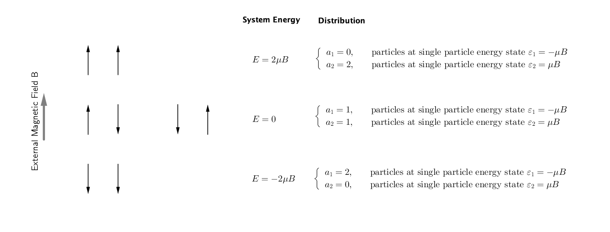
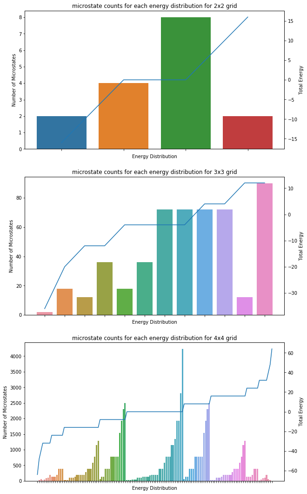

.. _most-probable-distribution:

Most Probable Distribution
==================================

.. index:: Most Probable Distribution

.. admonition:: Applications of Most Probable Distribution
   :class: note

   Application of most probable distribution is discussed in :ref:`summary-boltzmann-statistics`.

In Boltzman distribution, one of the key ingredients is to calculate the most probable distribution. First things first, the most probable distribution is indicating the **distribution of energy** (abbr. **distribution**) that is most probable. On the other hand, we also talked about the probability of the microstates. It is crucial to understand the difference between distribution and microstates.

Microstates describes the configurations of the system which is the most detailed view of the system in statistical physics. A **distribution** of the system describes the number of particles on each energy levels of the particle.

.. admonition:: Why would we choose most probable distribution?
   :class: toggle

   First of all, tt can be derived easily.

   The most probable distribution in Boltzman theory is extremely sharp for large number of particles.

   Assuming an actual **distribution of the distribution**, :math:`\rho(\{\epsilon_i:a_i\})` where :math:`\{\epsilon_i:a_i\}` is a **distribution of energies**. The observable :math:`\langle\mathscr O\rangle` can be calculated using the following integral

   .. math::
      \langle\mathscr O\rangle = \int \mathscr \rho(\{\epsilon_i:a_i\}) O(\{\epsilon_i:a_i\}) d \{\epsilon_i:a_i\}.

   If :math:`\rho(\{\epsilon_i:a_i\})` is a delta function distribution, only the most probable distribution, :math:`\rho_{\text{most probable}}` is need to calculate observables.

   This can be demonstrated with numerical simulations.

.. admonition:: Other Possible Distributions
   :class: note

   Statistically speaking, energy distribution is not the only available distribution we have. We look into the energy distribution because we would like to derive something easy to use for physics using the fundamental assumption of the probabilities of the microstates.

   There are other granular distributions. In Ising model,

   1. distribution of the magnet directions, i.e., the number of magnets pointing upward and the number of magnets pointing downward, for each microstate,
   2. distribution of the total energies, i.e., the number of microstates with a specific energy.

.. _equal-a-prior-probability:

Equal A Prior Probability
------------------------------------

.. index:: Equal A Prior Probability

As mentioned in :ref:`what-is-statistical-mechanics`, a theory of the distribution of the microstates shall be useful for our predictions of the macroscopic observables.

.. admonition:: Equal A Prior Probability
   :class: warning

   For systems with enormous number of particles, we observe their macroscopic properties such as energies, pressure in experiments. But we have very limited information about the internal structure. The principle proposed by Boltzmann is that all these different possible configurations of microstructure are equally distributed, a.k.a., principle of equal *a prior* probabilities.

   **It should be noted that all the possible states to be used for the probabilities should produce the observables we already know.** For example, the total energy of the system, :math:`E`, and the volume of the gass, :math:`V` should be consistent for each of the microstates.

An Example of Calculations
----------------------------

.. admonition:: This is Only an Example for the Calculation
   :class: warning

   This example is not exactly an statistical physics problem since we do not have enough particles to make it statistically significant. For example, we use Sterling's approximation but this doesn't hold in this case.

The equal a-priori principle can be illustrated using a two-magnet system. For simplicity, we will ignore the interactions between the magnets. In the example, we use :math:`a_i` to denote the number spins on the different spin states (up or down),

.. math::
   \begin{cases}
   a_1 \qquad \text{Number of spins pointing downward}, \\
   a_2 \qquad \text{Number of spins pointing upward}
   \end{cases}

With an external magnetic field, the energy of the system is determined by

.. math::
   (s_1  + s_2) \mu B,

where :math:`s_i=\pm 1`.

.. _equal-a-priori-probability:

   A simple system of 2 magnets in an external magnetic field. The external magnetic field is pointing upwards. The energy of the system is labelled as :math:`E` and the distributions are labelled on the right. *In principle, we could also have multiple possible distributions for the same energy of the whole system. In our case, it is simply a coincidence that we only have on distribution corresponding to each energy of the system.*

.. admonition:: Extended Caption of :numref:`equal-a-priori-probability`
   :class: warning

   We have the following possible **energy distributions**.

   .. math::
      \begin{cases}
      a_1  = 0, & \qquad \text{particles at single particle energy state } \varepsilon_1 = -\mu B \\
      a_2  = 2, & \qquad \text{particles at single particle energy state } \varepsilon_2 = \mu B
      \end{cases}

   which has total energy of :math:`2\mu B` and number of microstates :math:`\Omega = 1`, and

   .. math::
      \begin{cases}
      a_1  = 1, & \qquad \text{particles at single particle energy state } \varepsilon_1 = -\mu B \\
      a_2  = 1, & \qquad \text{particles at single particle energy state } \varepsilon_2 = \mu B
      \end{cases}

   which has total energy of :math:`0` and number of microstates :math:`\Omega = 2`, and

   .. math::
      \begin{cases}
      a_1  = 2, & \qquad \text{particles at single particle energy state } \varepsilon_1 = -\mu B \\
      a_2  = 0, & \qquad \text{particles at single particle energy state } \varepsilon_2 = \mu B
      \end{cases}

   which has total energy of :math:`-2\mu B` and number of microstates :math:`\Omega = 1`.

Each of the possible configuration of the the two magnets is considered as a **microstate**. That being said, the equal a-prior principle tells us that the probabilities of the different configurations are the same, **for each total energy**, if we our restricting observable is energy. For example, the two states for total energy :math:`E=0` are have the same probability. This is an effort of least information assumption, a.k.a., the **Bernoulli's principle of indifference** [Buck2015]_.

In principle, we could calculate all observables of the system using this assumption. However, it will be extremely difficult to tranverse all the possible states (:ref:`numerical-calculations-to-iterate-through-all-microstates`).

Probabilities of Distributions
----------------------------------

Suppose we have an equalibrium system with energy 0. In above example of the 2-magnet system, we only have one distribution and two microstates. We do not need more granular information about the microstates. As we include more magnets, each total energy corresponds to multiple energy distributions. For example, the number of microstates associated with a energy distribution in an Ising model could be huge.

The number of microstates associated with each macrostates can be derived theoretically. Those results are presented in most textbooks. The derivation involves the following steps.

1. Find the total number of macrostates (single particle energy distributions), :math:`\Omega`.
2. Take the log of the distribution and find the maximum using Lagrange multipler method.
3. The most probable distribution should follow the Boltzman distribution of exponential distribution based on energy levels.

The Magic of Equal a Priori Probabilities
---------------------------------------------

Though assuming the least knowledge of the distribution of the microstates, we are still able to predict the observables. There exist several magical processes in this theory.

The first magic is the so-called more is different. Given thorough knowledge of a single particle, we still find phenomena unexplained by the single-particle property.

.. admonition:: How could Equal a Priori help?
   :class: warning

   Equal a priori indicates a homogeneous distribution. How would a homogeneous distribution of microstates be useful to form complex materials?

   The reason behind it is the energy degeneracies of the states. Some microstates lead to the same energy, as shown in :numref:`equal-a-priori-probability`. **Even for the same microstates, the distribution of energies will be different with different interactions applied.**

   Different degeneracies lead to different observable systems.

.. admonition:: Why is Temperature Relevant?
   :class: warning

   In this formalism, we do not consider the temperature. In the deriveation, we used the Lagrange multiplier method which introduced an equivalent of the temperature.

   Temperature is a punishment of our energy distribution. It sets the level of base energy.

.. _numerical-calculations-to-iterate-through-all-microstates:

How Expensive is it to Calculate the Distributions
-----------------------------------------------------

It is very expensive to iterate through all the possible microstates to simulate large systems. To demonstrate this, I use Python to iterate through all the possible states in an Ising model, without any observables constraints. All the results can be dervied theoretically. However we will only show the numerical results to help us building up some inutitions and to understand how expensive it is to iterate through all the possible states.

Ising Model with Self-interactions
~~~~~~~~~~~~~~~~~~~~~~~~~~~~~~~~~~~~~~~~~~~~~~~~~~~~~~~~~~

For example, we could calculate all the configurations and energies of the configurations using brute force. A simple estimation of the number of microstates is :math:`\Omega = 2^N`, where :math:`N` is the number of spins. The number grows exponentially with the number of spins.

   Microstate counts of energy distribution. The bars shows the number of microstates with the specific energy distributions, which indicates the probability of the corresponding distributions given the equal-a-priori principle. The line shows the corresponding energy of the distribution.

In reality, these calculations becomes really hard when the number of particles gets large. For benchmark purpose, I did the calculations in serial on a MacBook Pro (15-inch, 2018) with 2.2 GHz Intel Core i7 and 16 GB 2400 MHz DDR4. It takes about 20min to work out the 5 by 5 grid. The calculation time is scaling up as :math:`2^N` where :math:`N` is the total number of particles, if we do not implement any parallel computations or other tricks.

References
--------------------------

.. [Buck2015] `Buck, B., & Merchant, A. C. (2015). Probabilistic Foundations of Statistical Mechanics: A Bayesian Approach. <http://arxiv.org/abs/1512.01368>`_