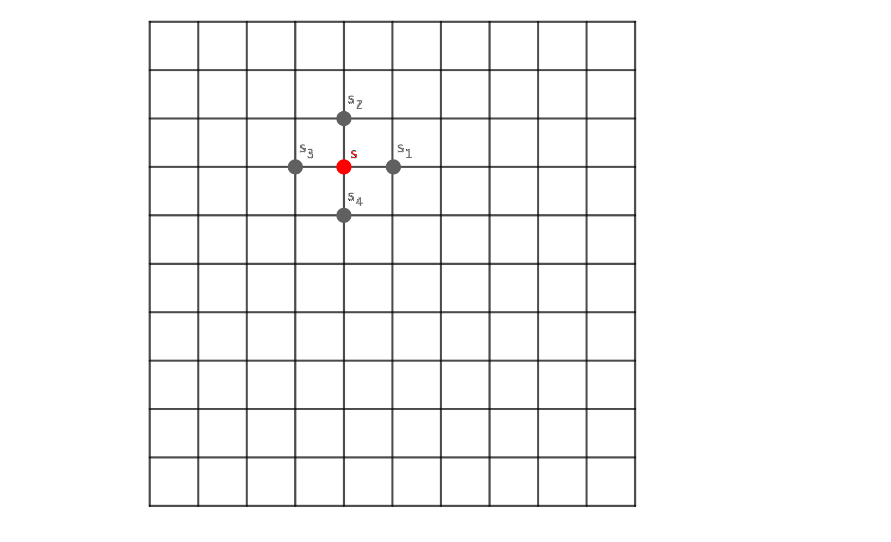
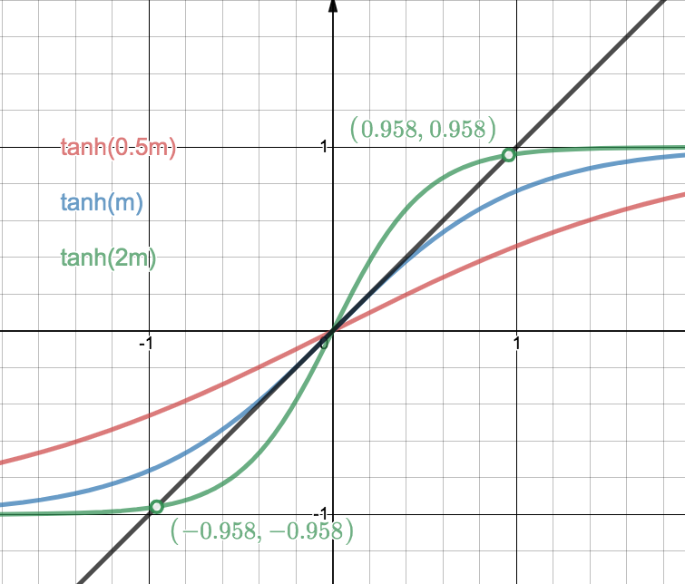

Phase Transitions
========================

Phase Transitions
------------------

Phase transitions are singularities of thermodynamic quantities. There exists many different orders of singularities:

1. First order: discountinuities in of thermodynamic quantities;
2. Second order: discountinuities in the first order derivatives of thermodynamic quantities.
3. ...

Phase transitions only exists in systems with infinite particles.

.. [Leo P. Kadanoff] `Kadanoff's PI Lectures <http://jfi.uchicago.edu/~leop/TALKS/Perimeter%20Stat%20Mech%20Lectures/lectures%20in%20PDF/Part%207%20Mean%20Field%20Theory.pdf>`_

.. admonition:: Phase Transitions in Other Fields
   :class: toggle

   If we are looking for well defined phase transitions in other fields, such as our society, it would be the best if we could all agree on which observables to use, aka, order parameters.

   For example, in social science, there is the model called Schelling's model which models the segregation of races. The model is fairly simple yet is able to match the data.

   The idea is that we have several races scatter on a grid. Each individual is more satistifed if the individual can live nearby a predefined percentage of population of races. If the individual is not satistifed, then the individual will move to another place.

   For better understanding, checkout this web app I wrote: `Schelling's segeration model <http://schelling.openmetric.org/>`_.

   Just like the Ising model, domains might appear. But domains might not appear for some certain parameters. This change is drastic. There is a phase transition. To be precise, we have to define the order parameter in Schelling's model. For example, we define the average size of the communities as our order parameter.

   1. For very low similarity requirements, our agents will be quite satistifed with whatever neighbours they have initially. Very little will change in this case. This is the so called frozen state. In this case, average size of the communities are small but the satisfactions are high.
   2. For very large similarity requirements, our agents is very hard to please. They will relocate all the time and remain not satisfied. This is the mixed state. Or average size of communities is small.
   3. In between, agents will move to live close to their own ethical groups. Domains will form. This is the segreged state. The average size of communities is large.

   There are also other parameters to consider but a phase diagram can be calculated.

   References:

   1. `Schelling’s Segregation Model, I <https://medium.com/@jxxcarlson/schellings-segregation-model-i-43e612241b62>`_
   2. `Schelling's Segregation Model | Model Thinking <https://www.coursera.org/lecture/model-thinking/schellings-segregation-model-1qEBU>`_
   2. `DT&SC 7-11: Schelling's Segregation Model @ YouTube <https://www.youtube.com/watch?v=AZlWOykGzYg>`_
   3. `Gauvin, L., Vannimenus, J., & Nadal, J. P. (2009). Phase diagram of a Schelling segregation model. European Physical Journal B, 70(2), 293–304. <https://doi.org/10.1140/epjb/e2009-00234-0>`_

.. _mean-field-theory:

Mean Field Thoery
-------------------

More is the same.

We take Weiss theory as an example. Weiss theory is a theory of ferromagnetism. In his theory, each molecule in the material serves as a small magnet.

To make it easy to understand, we assume the small magnets are arranged on a 2D grid.

   Magnets on a 2D grid. The red magnet :math:`s` is surrounded by four neighbours, :math:`s_1`, :math:`s_2`, :math:`s_3`, and :math:`s_4`.

The Hamiltonian for the magnet :math:`s` is

.. math::
   \mathscr H_s = - s ( J \sum_{i} s_i + H),

where :math:`\sum_i s_i` is summing over all the neighbours, i.e., 1,2,3,4 in our example, :math:`H` is the external magnetic field.

There are two key ideas in Weiss mean field theory.

The first idea is to think of the neighours being an average magnetic field :math:`m`. Thus each neighbour can be decomposed into the average magnetic field and the difference, :math:`s_i = m + (s_i - m)`.

.. math::
   \mathscr H_s =& - s ( J \sum_{i} s_i + H) \\
   =& -s ( J \sum_{i} (m + (s_i - m) ) + H) \\
   = & -s ( 4 J m - J\sum_i (s_i - m) + H ) \\
   = & -s ( 4 Jm + H ) + s J \sum_i (s_i - m) \\
   = & \mathscr H_{mf} + \mathscr H_{flu},

where

.. math::
   \mathscr H_{mf} = -s ( 4 Jm + H )

is the mean field Hamiltonian and

.. math::
   \mathscr H_{flu} = s J \sum_i (s_i - m)

is the fluctuations.

The second key idea is to assume translational symmetry on the grid. On this homogenous grid, each spin is no different from other spins. Thus the fluctuations :math:`\mathscr H_{flu}` must be averaged to 0, otherwise the translational symmetry is broken.

The translational symmetry also tells us that the average magnet field for each magnet should be the same and they should all be :math:`\langle s \rangle = m`.

On the other hand, statistical mechanics tells that the average should be calculated as

.. math::
   \langle s \rangle =& \frac{ \sum_s s e^{-\beta \mathscr H_{mf} } }{ \sum_s e^{-\beta \mathscr H_{mf} } } \\
   =& \frac{ e^{\beta ( 4 Jm + H ) } - e^{ - \beta ( 4 Jm + H ) } }{ e^{\beta ( 4 Jm + H ) } + e^{ - \beta ( 4 Jm + H ) } } \\
   =& \tanh( \beta (4Jm + H) ).

The two different views of the average magnetic field for a magnet should be the same, i.e.,

.. math::
   \tanh( \beta (4Jm + H) ) = m.
   :label: eq-weiss-theory-equation

This equation can be understood using graphical solutions.

   Examples of solving equation :eq:`eq-weiss-theory-equation` graphically.

In the example, we are solving the case for :math:`H=0`. For :math:`4\beta J=0.5`, the left side of the equation becomes :math:`\tanh(0.5 m)`. On the right hand side, we have :math:`m`. The value of :math:`m` must be determined by the interceptions of the left hand side and the right hand side. However, we only find :math:`m=0` which is paramagnetic. For :math:`4\beta J=2`, we do find two other solutions for :math:`m`. In fact, due to the slope of the hyperbolic tangent at origin, we only have 3 solutions if :math:`4\beta J>1`. This is interesting because this corresponds to a phase transition at different :math:`\beta`, i.e., :math:`1/k_B T`.

.. admonition:: Why is this an approximation
   :class: note

   Why is this an approximation?
   Because translational symmetry doesn't really hold all the time and the fluctuations are not necessarily 0. But it captures the primary feature of such a system.

This Weiss mean field theory also predicts phase transitions for 1D which is wrong. There is no phase transitions in 1D Ising model. What's more, the theory also predicts the critical temperature wrong. The reason behind it is related to the fact that the fluctuations will be significant around critical points. That being said, mean field theory is not precise enough for phase transition in some low dimensional systems. Just like in statistics, more neighbours will make our standard deviations smaller thus we reach a better approximation by using the mean field.

.. admonition:: Why does mean field theory even work?
   :class: important

   Why does mean field theory even work? From the view of mathematics, any continuous potential function can be Taylor expanded at the mean value of the magnetic field.

   The generic form of the Hamiltonian for magnets on a grid is

   .. math::
      \mathscr H = - \sum _{\langle i,j \rangle} J^{ij} \sigma_i \sigma_j - \mu \sum_i h^i \sigma_i

   Mean field treatment is

   .. math::
      H = - \sum _{\langle i,j \rangle} J^{ij} \sigma_i \sigma - \mu \sum_i h^i \sigma_i

   where :math:`\sigma = \sum_i \sigma_i/N` is the average spin configuration.

   In this approximation, we take the 0 order of spin configuration expansion. We can also include the second order if we need, but it brings in the fluction term.

.. note::
   Susceptibility is a parameter that shows how much an extensive parameter changes when an intensive parameter increases. Magnetic susceptibility is

   .. math::
      \chi(T)= \frac{\mathrm d M(T)}{\mathrm T}

.. important::
   What makes the phase transition in such a system? Finite system has no phase transitions because finite continuous function can only make up continuous function by addition. Phase transition happens when the correlation length becomes infinite. It is all about correlations.

References
~~~~~~~~~~~~~~~~~~~~~~~

1. `Kochmański, M., Paszkiewicz, T., & Wolski, S. (2013). Curie-Weiss magnet - A simple model of phase transition. European Journal of Physics, 34(6), 1555–1573. <https://doi.org/10.1088/0143-0807/34/6/1555>`_

.. _van-der-waals-gas:
