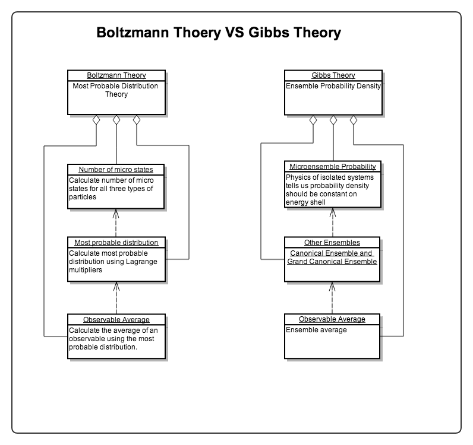

Equilibrium Statistical Mechanics Summary
================================================

.. note::
   This is a review of equilibrium statistical mechanics. Though I called it a review, it is more like a list of keywords at this moment.

Review of Thermodynamics
--------------------------------------------------

1. Description of States in statistical mechanmics: thermodynamical quantities as macroscopic state;
2. Kinematics: equation of state; :ref:`thermodynamical-potentials`.

   .. figure:: ../vocabulary/images/thermodynamicPotentials.png
      :align: center
      :width: 100%

      The relationship between different thermodynamic potentials. There are three different couplings and five different potentials. For more details please read vocabulary :ref:`thermodynamical-potentials` .

3. First principles: :ref:`laws-of-thermodynamics`
4. Dynamics: Phase transition; Stability; Response

.. _mu-space-and-gamma-space:
.. _discription-of-microstates:

Description of the Microstates
--------------------------------------

For a system with :math:`N` particles of :math:`r` degrees of freedom, we could always describe the microstates of the system by looking at the state of each particle. There are at least two different point of views, the :math:`\mu` space (mu space) and the :math:`\Gamma` space (Gamma space).

The :math:`\mu` space is a :math:`r` dimensional space where each dimension corresponds to one degree of freedom of the particle. Thus a point in the :math:`\mu` space represents a the state of one particle. To represent the microstate of the whole system, we need :math:`N` points in the :math:`\mu` space.

The :math:`\Gamma` space is a :math:`rN` dimensional space. In the :math:`\Gamma` space, we have a holistic view. Each point in the :math:`\Gamma` space represents the state of all the particles. For example, we use the first :math:`r` dimensions out of the :math:`rN` dimension to represent the state of the first particle, the next :math:`r` dimensions to represent the state of the second particle, and so on.

What is Statistical Mechanics
--------------------------------------

Physical systems are usually composed of a large amount of particles. In principle, we could calculate the macroscopic quantities if we know the exact motions of the particles. For example, we only need the momentum transfer per unit area to know the pressure of the gas and momentum transfer could be calculated if we know the motion of the particles.

This method is obviously unrealistic given the number of particles that we are dealing with. Alternatively, we could figure out the probabilities of each possible values of the macroscopic quantities, i.e., the probability of the system being on each point in the :math:`\Gamma` space. For each microscopic state, we could calculate the thermodynamic observables corresponding to it. However, we would get degeneracies of microscopic state for each combination of thermodynamic observables.

The Two Approaches of Statistical Mechanics
---------------------------------------------

The **probability distribution of the microscopic states**  of the system, :math:`p(\{O_i\})`, is needed to estimate the macroscopic observables :math:`\{O_i\}`. For example, to estimate the energy of the system, we take the statistical average using the distribution :math:`\int E p(E) \mathrm dE`.

However the microscopic state of the system is not known in general. We have to apply some assumptions and tricks.

There are two famous approaches developed in statistical mechanics. The Boltzmann's approach is utilizing the most probable distributions while the Gibbs' approach is using ensembles. They do not only differ from the way of estimating the probabilities of the states but also differ philosophically.

   Modeling of the two theories. Refer to :ref:`most-probable-distribution`.

.. _summary-boltzmann-statistics:

Boltzmann Statistics
~~~~~~~~~~~~~~~~~~~~~~~

As mentioned in :ref:`discription-of-microstates`, many microstates have the same observables such as energy :math:`E`. For each value of energy, we could figure out the number of microstates, the distribution of microstates :math:`\Omega(E, \cdots)`. What makes this distribution powerful is that we could figure out the total number of microstates for this distribution by integrating or summing up for all energies :math:`\int \Omega(E, \cdots) \mathrm d E \mathrm d\cdots`. The total number of microstates is closely related the the probability of this distribution as will be discussed below. Meanwhile, we could calculate the thermodynamic observables using the distribution.

In statistical physics, we will be focusing on the **distribution of the microstates** with respect to thermodynamic variables.

In Boltzmann statistics, we follow these guidelines.

1. Two postulates:

   1. Occurrence of state in phase space ( :ref:`equal-a-prior-probability` ): all microstates have the same probabilities of occurence; This means that the most probable distribution for different energy :math:`\Omega(E, \cdots)` should have the most total number of microstates, :math:`\int \Omega(E, \cdots) \mathrm d E \mathrm d\cdots`.
   2. Which state the equilibrium system is staying at: the most probable microstate. This means that the most probable distribution discussed in 1 will be the actual distribution of the system.

2. We find the most probable distrinution by maximizing the total number of microstates. Boltzmann distribution and Boltzmann factor is derived from this.
3. Partition function makes it easy to calculate the observables.

   1. Density of state :math:`g(E)` ;
   2. Partition function :math:`Z = \int g(E) \exp(-\beta E) \mathrm dE`; Variable of integration can be changed;
   3. Systems of 3N DoFs :math:`Z = Z_1^{3N}`.
   4. Macroscopic observables are calculated by taking specific transformations such as derivatives of the partition function.

4. Observable

   0. Assumptions about free energy :math:`A = - k_B T\ln Z`; Combine this with thermodynamics potential relations we can calculate entropy then everything.
   1. Internal energy :math:`U = \avg{E} = - \partial_\beta \ln Z`; All quantities can be extracted from partition function except those serve as variables of internal energy.
   2. Heat capacity :math:`C = \partial_T U`

Gibbs Ensemble Theory
~~~~~~~~~~~~~~~~~~~~~~~~~

1. Ensembles
2. Density of states; Liouville equation; Von Neumann equation
3. Equilibrium
4. Three ensembles
5. Observables

Boltzmann Factor
~~~~~~~~~~~~~~~~~~~~~~~~~~~

Boltzmann factor appears many times in thermodynamics and statistical mechanics. In Boltzmann's most probable theory, ensemble theory, etc.

Applications of These Theories
-------------------------------

Oscillators
~~~~~~~~~~~~~~~~~~

Theories of chains of oscillators in different dimensions are very useful. In fact the fun thing is, most of the analytically solvable models in physics are harmonic oscillators.

A nice practice for this kind of problem is to calculate the heat capacity of diatom chain. A chain of N atom with alternating mass M and m interacting only through nearest neighbors.

The plan for this problem is

1. Write down the equation of motion for the whole system;
2. Fourier transform the system to decouple the modes (by finding the eigen modes);
3. Solve the eigen modes;
4. Calculate the partition function of each mode;
5. Sum over each mode.

Problem is, we usually can not solve the problem exactly. So we turn to Debye theory. Debye theory assumes continuous spectrum even though our boundary condition quantizes the spectrum. So we need to turn the summation into integration using DoS using any of the several ways of obtaining DoS. Finally we analyze the different limits to get the low temperature or high temperature behavior.

.. hint::
   Here are several methods to obtain DoS. **To do!**

Heat Capacity
~~~~~~~~~~~~~~

1. Classical theory: equipartition theorem;
2. Einstein theory: all modes of oscillations are the same;
3. Debye theory: difference between modes of oscillations are considered.

Gibbs Mixing Paradox
~~~~~~~~~~~~~~~~~~~~~

:ref:`gibbs-mixing-paradox` is important for the coming in of quantum statistical mechanics.

Mean Field Theory
~~~~~~~~~~~~~~~~~~

:ref:`mean-field-theory` is the idea of treating interaction between particles as interactions between particles and a mean field.

Van der Waals Gas
~~~~~~~~~~~~~~~~~~

:ref:`van-der-waals-gas` can be derived using Mayer expansion and Leonard-Jones potential.
