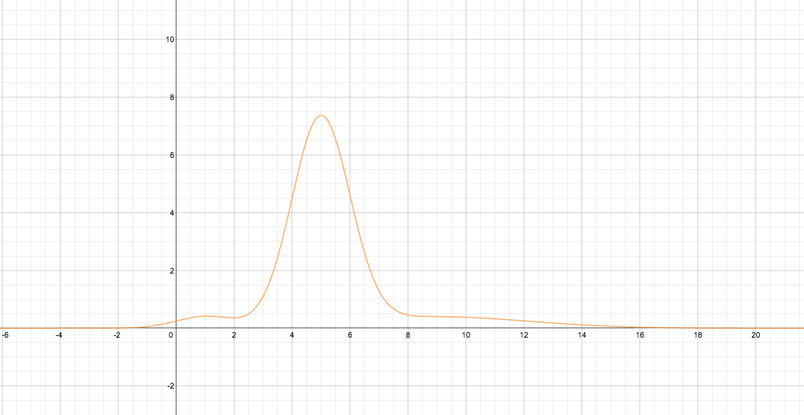

Master Equation Examples
========================================

.. index:: Irrersibility

.. role:: highlit

Irrersibility
-----------------------------

Fourier series are complete,

.. math::
   F(x) = \sum_{n=0}^{n=\infty} a_n \cos(\omega_n t) .

Any equations can be expanded using Fourier series including the decay behavior we have seen in previous lectures.

However the problem is, for finite system, the expansion is not really complete. The series composed by all these finite components might not be decay and recurrence could happen. But the time needed for recurrence is so long that we never see it.

Master Equation
--------------------

Solution to descrete master equation with nearest neighbour interaction is

.. math::
   P_m(t) = P_m(0)I_m(2Ft)e^{-2Ft}

where :math:`I_m(2Ft)e^{-2Ft}` is the :highlit:`propagator`.

Sometimes we want to know where the particle goes after a while. In this case, we should find out :highlit:`second moment`, :math:`\langle m^2 \rangle`.

To find out second moment, take the second derivative of :math:`P^k(t)`,

.. math::
   P^k &=\sum_m P_m e^{imk} \\
   \frac{\partial^2}{\partial k^2} P^k &= \sum_m P_m (i m)^2 e^{imk} .

Set :math:`k=0`, we have

.. math::
   \langle m^2 \rangle := \sum_m m^2 P_m =\frac{\partial^2}{\partial k^2} .

.. note::
   So we don't need to calculate :math:`P_m(t)` which takes a lot of time to calculate.

.. hint::
   No mater what kind of interaction the system has,

   .. math::
      P^k(t) = P^k(0) e^{-\cdots}

   is alway true.

Continuum Limit
----------------

In continuum limit, our master equation becomes

.. math::
   \frac{\partial}{\partial t} P = D \frac{\partial^2 P}{\partial x^2}

which is infact a diffusion equation.

.. hint::
   * Propagators of this equation is gaussian like.
   * Propagators of discrete master equation is a decay, :math:`I_m(2Ft)e^{-2Ft}`.

.. warning::
   In principle, we can take some limit of the master equation propagator and make it the diffusion propagator.

Second moment of diffusion equaiton is the Einstein brownian motion result

.. math::
   \langle x^2 \rangle = 2 D t .

where

.. math::
   \langle x^2\rangle &:= \int_{-\infty}^{+\infty} P(x,t) x^2 dx \\
   \langle m^2 \rangle &:= \sum_{-\infty}^{+\infty} P_m(t) m^2  .

Landau-Teller Master Equation
--------------------------------

Consider a system in a heat bath, we can expand the system to second order and the system becomes a HO or HOs. Fermi golden rule tells us that HO can only have nearest energy transition.

Continuous Grid or Energy
~~~~~~~~~~~~~~~~~~~~~~~~~~

.. note::
   Different energy states in a system should have

   .. math::
      \frac{f_1}{f_1'} = e^{-\frac{\epsilon_1 - \epsilon_1'}{kT}} .

   And :math:`f_1\neq f_1'` most of the time. For the case of HO

   .. math::
      \frac{f_1}{f_1'} = e^{-\frac{\hbar \omega}{kT}} .

Here in such a system

.. math::
   \frac{d}{dt}P_m =& k \left[(m+1)(P_{m+1} - e^{-\beta \hbar \omega} P_m)\right. \\
   & \left. +m(e^{-\beta \hbar\omega} P_{m-1} - P_m)  \right] .

.. note::
   Transition

   .. math::
      \frac{d}{dt}P_m =& (R_{m,m+1}P_{m+1} -  R_{m,m-1}P_{m-1}) \\
      & - (R_{m+1,m}P_m + R_{m-1,m}P_m)

   is called :highlit:`Landau-Teller master equation`. It's good for non-translational-invariant system.

1-D Discrete Master Equation
------------------------------

.. math::
   \frac{d}{dt}P_m= F(P_{m+1} + P_{m-1} -2 P_m)

with solution

.. math::
   P_m(t) = \sum_n \Pi_{m-n}(t) P_n(0)

in which :math:`\Pi_{m-n}(t) = e^{-2Ft}I_m(2Ft)` is the propagator.

.. hint::
   If the sytem has no translational invariance,

   .. math::
      P_m(t) = \sum_n \Pi_{m,n}(t) P_m(0)

   propagator becomes :math:`\Pi_{m,n}(t)` depends on both m and n.

Continuum Limit
----------------

.. math::
   \frac{\partial}{\partial t}P(x,t) = D\frac{\partial^2}{\partial x^2} P(x,t)

.. math::
   \Pi(x,t) = \cdots e^{-\frac{x^2}{\cdots}}/\sqrt{\cdots t}

Fourier transform

.. math::
   \frac{\partial P_F(k,t)}{\partial t} = - D k^2 P_F(k,t)

Solution

.. math::
   P_F(k,t) = P_F(k,0) e^{-Dk^2t}

Inverse

.. math::
   P(x,t) = \int \Pi(x-x',t) P(x',0) dx'

.. index:: Propagator

.. role:: highlit

Propagator
----------------------------

To solve master equation, we usually find out the propagator :math:`\Pi(x-x',t)`. For simple discrete master equation, we have the propagator with the form :math:`I_m(2Ft)e^{-2Ft}`.

.. figure:: images/distInit.png
   :alt: initial distribution
   :width: 90%

   Some initial distribution

For continuous master equation which is the diffusion equation, given the initial distribution, it evolves according to

.. math::
   \frac{\partial}{\partial t} P(x,t) = \zeta \frac{\partial}{\partial x} P(x,t) + D \frac{\partial^2}{\partial x^2} P(x,t) .

Then after infinite time, we have the final distribution.

   Some final distribution

**As long as the system has translational or rotational invariance, we can use Fourier transform to reduce the higher order derivatives to solve the equation.**

For :math:`\zeta =0`, there is only diffusion, so we have translational invariance. Fourier transform for continuous equation is

.. math::
   \frac{\partial}{\partial x} e^{ikx}=ike^{ikx} &\implies \frac{\partial}{\partial x} \to ik \\
   \frac{\partial^2}{\partial x^2} e^{ikx} = -k^2 e^{ikx} & \implies \frac{\partial^2}{\partial x^2} \to -k^2

So we can write down the transformed equation right away (for :math:`\zeta=0` case).

.. math::
   \frac{\partial}{\partial t}P^k = -D k^2 P^k

and the solution to this equation is

.. math::
   P^k(t) = P^k(0) e^{-D k^2 t} .

To find out the propagator, we complete the square,

.. math::
   P(x,t) & = \int P(k,0) e^{-Dk^2t+ikx} dk \\
   & = \int P(k,0) e^{-\frac{x^2}{4Dt}} e^{-Dt(k-\frac{ix}{2Dt})^2 }dk \\
   & = e^{-\frac{x^2}{4Dt}}  \int P(k,0) e^{-Dt(k-\frac{ix}{2Dt})^2 }dk

The propagator is finally

.. math::
   \Pi(x,t) = \frac{e^{-\frac{x^2}{4Dt}}}{\sqrt{4\pi Dt}}

.. warning::
   Somehow I can't derive it.

.. hint::
   There might be sigularity in the propagator. One example of it is logorithm sigularity in 2D.

Bias in Master Equation
-------------------------

When :math:`\zeta\neq 0`, the first term on RHS is a decay or viscous term.

.. math::
   \frac{\partial}{\partial t}P(x,t) = \zeta \frac{\partial}{\partial x}P(x,t) + D\frac{\partial^2}{\partial x^2}P(x,t)

.. hint::
   To check the properties of :math:`\zeta`, set :math:`D=0`.

   .. math::
      \frac{\partial}{\partial t} P = \zeta \frac{\partial}{\partial x} P \Rightarrow P\propto e^{k_w(\omega + \zeta t)}

   So we know that when :math:`k_w > 0`,

   1. :math:`\zeta > 0` : exponential grow;
   2. :math:`\zeta < 0` : decay

We can Fourier transform then complete the square to solve this kind of problem.

.. hint::
   This formalism is very much like the :highlit:`Gauge Transformation`. We define a new derivative

   .. math::
      \frac{\partial}{\partial x} \to \frac{\partial}{\partial x} + \Gamma(x)

   Then we put this new derivative into diffusion equation,

   .. math::
      & \frac{\partial}{\partial t} P(x,t) = D\frac{\partial^2}{\partial x^2} P(x,t) \\
      \to & \frac{\partial}{\partial t} P(x,t) = D \left(\frac{\partial^2}{\partial x^2} P(x,t) + 2\Gamma\frac{\partial}{\partial x}P(x,t) \right) + D\left( P\left( 2\Gamma^2 + \frac{\partial}{\partial x} \Gamma \right) \right)

   Now we define :math:`\zeta := 2\Gamma`, and let :math:`2\Gamma^2 + \frac{\partial}{\partial x} \Gamma`. [1]_  The diffusion equation under this kind of transformation becomes the one we need.

   :highlit:`Does it imply that the diffusion equation and gauge transformation are related?`

   We might find some symmetry using this method.
