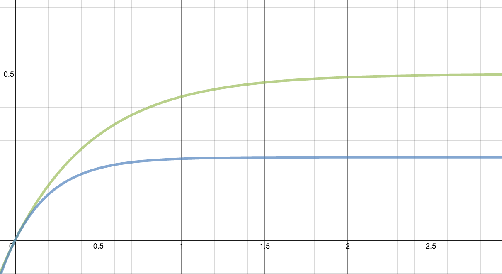

Smoluchowski Equation
========================================

Smoluchowski Equation
-----------------------

.. figure:: images/smoluchowski.png
   :alt: Probability distribution with an attraction point.
   :width: 90%
   :align: center

   Probability distribution with an attraction point.

If we have some potential with a mininum point, then the motion of particles will be attracted to this minimum point. With the force in mind, we can write down the master equation, which is the :math:`\zeta \neq 0` case,

.. math::
   \frac{\partial}{\partial t} P(x,t) = \frac{\partial}{\partial x}\left( \frac{\partial U(x)}{\partial x} P(x,t)  \right) + D \frac{\partial^2}{\partial x^2} P(x,t) .

This equation is called the Smoluchowski equation.

A very simple case is

.. math::
   \frac{\partial}{\partial t} P(x,t) = \gamma \frac{\partial}{\partial x}\left(x P(x,t)  \right) + D \frac{\partial^2}{\partial x^2} P(x,t) .

which corresponds to a quadrople potential :math:`U(x) = \gamma x^2/2`.

.. hint::
   We have :highlit:`methods of characteristics` to solve such partial differential equations.

We can also use Fourier transform to solve the problem. However, we will only get

.. math::
   \frac{\partial}{\partial t} P^k = \cdots \frac{\partial}{\partial k} P^k  + \cdots k^2 P^k

and the propagator is

.. math::
   \Pi(x,x',t) = \frac{e^{-(x - x' \exp(-\gamma t))^2}{4D\mathscr T(t)} }{\sqrt{4 \pi D \mathscr T(t)}}

where :math:`\mathscr T(t) = \frac{1-e^{-2\gamma t}}{2\gamma}`.

   The redefined time parameter in the solution of Smoluchowski equation example.

.. [1] This is :highlit:`Riccati's equation`. More information `here <http://www.wolframalpha.com/input/?i=solve%5Bdf%2Fdx%3D%3D-2f%5E2%5D>`_.
