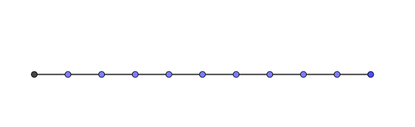

Solving Master Equations
========================================

.. index:: Master Equation

.. role:: highlit

Solving Master Equations
-----------------------------

A master equation

.. math::
   \frac{d P_m}{dt} = \sum_n R_{mn} P_n - \sum_n R_{nm} P_m
   :label: eqn-master-eqn-raw

can be simplified into

.. math::
   \frac{d P_m}{dt} + \sum_n A_{mn}P_n = 0 .
   :label: eqn-master-eqn-comb

To figure out the elements of this new matrix :math:`A`, we need to understand how to combine the RHS of master equation. The matrix form of the master equation :eq:`eqn-master-eqn-raw` is

.. math::
   \partial_t \begin{pmatrix} P_1 \\ P_2 \\ \vdots \\ P_N \end{pmatrix} = \begin{pmatrix} 0  & R_{12} & \cdots & R_{1N} \\ R_{21}  & 0 & \cdots & R_{2N} \\ \vdots & \vdots & \ddots & \vdots \\ R_{N1} & R_{N2} & \cdots & 0   \end{pmatrix} \begin{pmatrix} P_1 \\ P_2 \\ \vdots \\ P_N \end{pmatrix}   - \sum_{n}R_{nm} \begin{pmatrix}  1 & 0 & \cdots & 0 \\  0 & 1 & \cdots & 0 \\ \vdots & \vdots & \ddots &  0  \\ 0 & 0 & \cdots & 1  \end{pmatrix}  \begin{pmatrix} P_1 \\ P_2 \\ \vdots \\ P_N \end{pmatrix}

Since :math:`A_{mm} = \sum_n R_{nm}` is just a real number, we can combine the two matrices on the RHS,

.. math::
   \partial_t \begin{pmatrix} P_1 \\ P_2 \\ \vdots \\ P_N \end{pmatrix} + \begin{pmatrix} A_{11}  & -R_{12} & \cdots & -R_{1N} \\ -R_{21}  & A_{22} & \cdots & -R_{2N} \\ \vdots & \vdots & \ddots & \vdots \\ -R_{N1} & -R_{N2} & \cdots & A_{NN}   \end{pmatrix} \begin{pmatrix} P_1 \\ P_2 \\ \vdots \\ P_N \end{pmatrix} = 0  .

The :math:`\mathbf A` matrix is then defined as

.. math::
   A_{mn} = \begin{cases} -R_{mn} &\quad  n \neq m \\ \sum_{n} R_{nm} & \quad n=m  \end{cases}

The abstract form of the master equation :eq:`eqn-master-eqn-comb` is

.. math::
   \partial_t \mathbf P + \mathbf A \mathbf P = 0 .
   :label: eqn-master-eqn-comb-abstract

To solve it, we need to diagonalize :math:`\mathbf A` so that the solution can be written down as

.. math::
   \mathbf P_{\text{diag}} = e^{- \mathbf A_{\text{diag}} t} .

In general, the diagonailization is achieved by using an invertible matrix :math:`\mathbf S`,

.. math::
   \partial_t \bf S^{-1} P + S^{-1}AS S^{-1} P = 0

in which :math:`\mathbf A_{\text{diag}} = \bf S^{-1} P S` and :math:`\mathbf P_{\text{diag}} = \bf S^{-1} P`.

.. admonition:: Food for Thought
   :class: warning

   Is there a mechanism that ensures the :math:`\mathbf A` is :highlit:`invertible` ? If :math:`\mathbf A` is :highlit:`defective` , none of these can be done. Do all physical systems have invertible :math:`\mathbf A`?

.. admonition:: Quantum Mechanics
   :class: note

   The master equation :eq:`eqn-master-eqn-comb-abstract` is similar to the Schrodinger equation quantum mechanics

   .. math::
      i\hbar \frac{\partial }{\partial t} \ket{\psi} = \hat H \ket{\psi}.

   It is also quite similar to the Liouville equation,

   .. math::
      i\partial_t \rho^N = \hat L^N \rho^N .

Solving Master Equations: Fourier Transform
---------------------------------------------

Fourier transform is a fast and efficient method of diagonalizing :math:`\mathbf A` matrix.

We consider the case that a coarse-grain system with translational symmetry. The values of the elements in :math:`\mathbf A` matrix only dependends on :math:`l:= n-m`, i.e.,

.. math::
   \partial_t P_m  + \sum_n A_{mn} P_n  = 0.

For translational symmetric system, a discrete Fourier transform is applied to find out the normal modes. Define the kth mode as

.. math::
   P^k = P_m e^{ikm} .
   :label: eqn-fourier-transform-kth-mode

Multiply :math:`e^{ikm}` on both sides of the master equstion and sum over :math:`m`, we get

.. math::
   \sum_m \partial_t P_m e^{ikm} + \sum_m \sum_n e^{ikm}A_{m-n} P_n = 0.

With the definition of the kth mode defined in :eq:`eqn-fourier-transform-kth-mode`, the master equation can be written as

.. math::
   \partial_t P^k + \sum_n\sum_m e^{ik(m-n)}A_{m-n} e^{ikn}P_n = 0,

which "accidently" diagonalizes the matrix :math:`\mathbf A`. Define the kth mode of :math:`\mathbf A` as :math:`A^k = \sum_{l=m-n} e^{ik(m-n)}A_{m-n}`. The master equation

.. math::
   \partial_t P^k + \sum_{l=m-n}e^{ik(m-n)}A_{m-n} \sum_n e^{ikn}P_n = 0

is reduced to

.. math::
   \partial_t P^k + A^k P^k = 0 \qquad\text{No summation over k!.}

.. note::
   Note that summation over n and m is equivalent to summation over n and m-n.

Finally we have the solution for the normal modes,

.. math::
   P^k(t) = P^k(0) e^{-A^k t} .

To find out the final solution, perform an inverse Fourier transform on the kth mode,

.. math::
   P_m(t) = \frac{1}{N} \sum_k P^k(t) e^{-ikm} .

.. important::
   Due to the Born van Karman BC, we chose,

   .. math::
      e^{ikm} = e^{ik(m+N)}

   which leads to

   .. math::
      k=\frac{2\pi}{N} .

   A discrete transform will become an integral if we are dealing with continous systems. It is achieved by using the following transformation,

   .. math::
      \frac{1}{N}\sum_k  \rightarrow \frac{1}{2\pi} \int dk.

   This transformation is important because the discrete transform has :math:`\frac{1}{N}\sum_k` in it.

Finite Chain with Nearest-Neighbor Interactions
-----------------------------------------------------

   Finite chain with nearest-neighbour interactions

On a 1D finite chain, the transfer rate is

.. math::
   R_{mn} = F(\delta_{m,n-1}+ \delta_{m,n+1}).

which leads to the following master equation,

.. math::
   \partial_t P_m = F(P_{n+1} + P_{n-1}) -2F P_m .
   :label: eqn-master-equation-1d-finite-chain-nn-interactions

Perform a discrete Fourier transform on equation :eq:`eqn-master-equation-1d-finite-chain-nn-interactions`,

.. math::
   \partial_t P^k  = F(e^{ikm} P_{m+1} + e^{ikm} P_{m-1} -2 P^k) .

Collect terms, we get

.. math::
   \partial_t P^k = 4F\sin^2\frac{k}{2} .

The solution for the kth mode is solved,

.. math::
   P^k(t) = P^k(0) e^{-4F \sin^2\frac{k}{2} t} .

To retrieve the solution to the original master equation, an inverse Fourier transform is applied,

.. math::
   P_m(t)  = \frac{1}{N} \sum_ {k} P^k(t) e^{-i km} .

Apply Born-Von Karman boundary condition, we find that :math:`k` is quantized,

.. math::
   k = \frac{2\pi}{N} n, \qquad n=0,1,2, \cdots, N-1 .

Matrix Form
~~~~~~~~~~~~~~~~~~~~~~~

The matrix form of the equations makes it easier to understand. Here we work out the 1D finite chain problem using the matrix form explicitly.

First of all, citing the master equation :eq:`eqn-master-equation-1d-finite-chain-nn-interactions`, we have

.. math::
   \partial_t P_m = F(P_{n+1} + P_{n-1}) -2F P_m .

We rewrite it in the matrix form

.. math::
   \partial_t \begin{pmatrix} P_1 \\ P_2 \\ P_3 \\ P_4 \\ P_5 \\ P_6 \end{pmatrix} + F \begin{pmatrix}  2 & -1 & 0 & 0 & 0 & -1 \\ -1 & 2 & -1 & 0 & 0 & 0 \\0 & -1 & 2 & -1 & 0 & 0 \\ 0 & 0 & -1 & 2 & -1 & 0 \\ 0 & 0 & 0 & -1 & 2 & -1 \\ -1 & 0 & 0 & 0 & -1 & 2 \end{pmatrix} \begin{pmatrix} P_1 \\ P_2 \\ P_3 \\ P_4 \\ P_5 \\ P_6 \end{pmatrix} = 0

.. admonition:: Matrix Form Makes a Difference
   :class: toggle

   An easy method to get the matrix form is to write down the :math:`\mathbf R` matrix whose diagonal elements are all 0s. We construct the :math:`\mathbf A` matrix by adding a minus sign to all elements and use the sum of the original elements at the diagonal in the corresponding line. One should pay attention to the signs.

   The :highlit:`additive of the matrices` makes it possible to :highlit:`decomposed a complicated matrix into several simple matrices.`

To solve this equation, we diagonalize the 6 times 6 matrix. Similar to the discrete Fourier transform we used in the previous method, we have

.. math::
   \partial_t \begin{pmatrix} P^{k_1} \\ P^{k_2}\\ P^{k_3}\\ P^{k_4}\\ P^{k_5}\\ P^{k_6} \end{pmatrix} + 4F \begin{pmatrix} \sin^2\frac{k_1}{2} 0 & 0 & 0 & 0 & 0 \\ 0 &  \sin^2\frac{k_2}{2} & 0 & 0 & 0 & 0 \\ 0 & 0 &  \sin^2\frac{k_3}{2} & 0 & 0 & 0 \\ 0 & 0 & 0 & \sin^2\frac{k_4}{2} & 0 & 0 \\ 0 & 0 & 0 & 0 &  \sin^2\frac{k_5}{2} & 0 \\ 0 & 0 & 0 & 0 & 0 &  \sin^2\frac{k_6}{2}   \end{pmatrix} \begin{pmatrix} P^{k_1} \\ P^{k_2}\\ P^{k_3}\\ P^{k_4}\\ P^{k_5}\\ P^{k_6} \end{pmatrix} = 0

We imediately recognize the solution,

.. math::
   P^k(t) = P^k(0) e^{-4F\sin^2(k/2) t} .

.. admonition:: Eigenvalue Problem
   :class: hint

   Note that the elements of the diagonailized :math:`\mathbf A_{\text{diag}}` matrix are just the eigenvalues of :math:`\mathbf A` matrix with their corresponding eigenvectors. The descrete master equations is equivalent to the eigenvalue problem of :math:`\mathbf A` matrix.

Infinite Chain with Nearest-Neighbor Interactions
---------------------------------------------------------------------

For an infinite chain, we have exactly the same master equation. The difference lies in the boundary conditions. For infinite chain, we have :math:`N\rightarrow \infty` and

.. math::
   \frac{1}{N}\sum_k \rightarrow \frac{1}{2\pi}\int dk .

.. admonition:: Validate the Relation
   :class: hint

   The way to check this result is to check the sum. Apply the operators on unity, both sides should converge to 1,

   .. math::
      \frac{1}{N}\sum_{k=1}^{N} 1 = 1 \Leftrightarrow \frac{1}{2\pi}\int_{-\pi}^{\pi} 1 dk = 1

The solutions are

.. math::
   P_m(t) &= \frac{1}{2\pi} \int _{-\pi}^{\pi} P^k(0) e^{-2F(1-\cos{k})t} e^{-ikm} dk \\ &=  P^k(0)  e^{-2Ft} \frac{1}{2\pi} \int_{-\pi}^{\pi} e^{2Ft\cos{k}} e^{-ikm} dk \\
   & = P^k(0)  e^{-2Ft} \mathrm{I_m}(2Ft)

or

.. math::
   P_m(t) = P_m(0)I_m(2Ft)e^{-2Ft}

where :math:`I_m(2Ft)e^{-2Ft}` is the :highlit:`propagator`.

.. index:: Modified Bessel Function

.. admonition:: Modified Bessel Function
   :class: important

   **Vocabulary**: The :highlit:`modified Bessel function` is defined as

   .. math::
      \mathrm{I_m} (z) = \frac{1}{2\pi}\int_{-\pi}^{\pi} e^{-ikm} e^{z\cos{k}} dk  .

   Since the argument has imaginary part in it, it is also called the Bessel function of imaginary argument.

   .. figure:: ../vocabulary/images/besselIFunctions1stKind.png
      :align: center
      :width: 100%

      Source: `BesselI_Functions_(1st_Kind) @ Wikipedia <https://en.wikipedia.org/wiki/File:BesselI_Functions_(1st_Kind,_n%3D0,1,2,3).svg>`_

2D Lattice
-----------

A 2D lattice is shown in :numref:`fig-master-eqn-2d-lattice-illustration`.

.. _fig-master-eqn-2d-lattice-illustration:
.. figure:: images/equilateralTriangleLattice.png
   :alt: equilateral Triangle Lattice
   :align: center

   An equilateral triangle lattice. Source: `Equilateral Triangle Lattice by Jim Belk @ Wikipedia <https://commons.wikimedia.org/wiki/File:Equilateral_Triangle_Lattice.svg>`_

We require it to have translational symmetry in both x and y directions. The solution is the product of solutions to x and y directions,

.. math::
   P_m(t) = e^{-2(F_x+F_y)t} \mathrm{I_m}(2F_xt) \mathrm{I_m}(2F_y t)

Continuum Limit
-----------------

For a continuum system,

.. math::
   \partial_t P_m &= F(P_{m-1} + P_{m+1}) - 2FP_m \\
   & = F(P_{m+1}-P_m -(P_m-P_{m-1})) \\
   & = F \epsilon^2 \frac{ (P_{m+1}-P_m)/\epsilon -(P_m-P_{m-1})/\epsilon )  }{\epsilon}

We can identify the form of derivatives on the right hand side but it becomes zero if :math:`F` is a constant when we take the limit :math:`\epsilon \rightarrow 0`.

On the other hand, :math:`F` should increases when the two particle sites becomes closer. To reconcile the zero-right-hand-side problem, we assume that

.. math::
   F = \frac{D}{\epsilon^2} .

The continuum limit of our master equation becomes the diffusion equation,

.. math::
   \frac{\partial P(x,t)}{\partial t} = D\frac{\partial^2 P(x,t)}{\partial x^2}.
