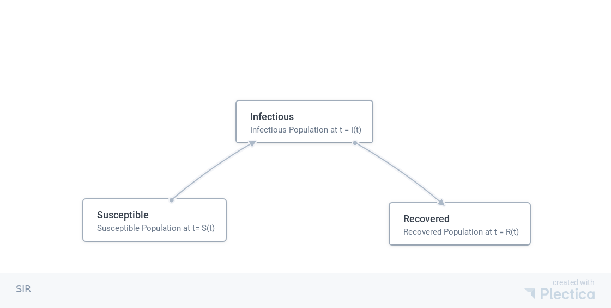

Classical Models in Epidemics
==================================

SIR
-------------------

   SIR model

The Kermack-McKendrick deterministic model describes the transitions between the different populations. The susceptible population :math:`S(t)` decrease at a rate :math:`-\alpha I(t) S(t)`, where :math:`\alpha` is the average probability of getting infected by the infected population. The recovery rate of the infected population is :math:`\rho`.

.. math::
   \frac{dS(t)}{dt} &= -\alpha I(t) S(t) \\
   \frac{dI(t)}{dt} &= \alpha S(t) I(t) - \rho I(t),
   :label: eqn-kermack-mckendrick-eqn-n

with constraint

.. math::
   S(t) + I(t) + R(t) = N,

where :math:`N` is the total population. [Martcheva2015]_

The limiting behavior of the system is also intuitive. If the infected population is quarantined, i.e., :math:`\alpha=0`, the infected population decays exponentially with a half life :math:`1/\rho`. Notice that the populations can only be integers. When :math:`S(t)<1`, the infected population moves to the exponential decay phase.

At a specific time :math:`t=t_t`, we might reach the threshold that

.. math::
   \alpha S(t_t) - \rho = 0.

Suppose the susceptible population is larger initially, we would have :math:`\alpha S(t_0) - \rho > 0` initially. The infected population will grow. The threshold indicates a flipping moment when the infected population will start to decrease.

The threshold requires

.. math::
   \frac{\alpha S(t_t)}{\rho} = 1.

When :math:`\frac{\alpha S(t_t)}{\rho}>1`, the infected population is growing. It is convinient to define

.. math::
   R(t) = \frac{\alpha S(t)}{\rho}.

If :math:`R(t)>1`, the infected population will grow. If :math:`R(t)<1`, the infected population will decrease.

Simulate SIR Using Poisson Process
~~~~~~~~~~~~~~~~~~~~~~~~~~~~~~~~~~~~~

The transition events of susceptible person being infected (:math:`S\to I`) and infected person being recovered (:math:`I\to R`).

The rates are determined by the equation :eq:`eqn-kermack-mckendrick-eqn-n`,

.. math::
   Y_{S\to I}\left(\int_0^t \alpha I(t') S(t') dt' \left)

and

.. math::
   Y_{I\to R}\left( \int_0^t \rho I(t') dt' \left).

Whenever a even is trigger in the process :math:`Y_{S\to I}`, we will have one more infected person and one less susceptible person.

References
--------------

.. [Martcheva2015] `Martcheva, M. (2015). Introduction to Epidemic Modeling, 9–31. <https://doi.org/10.1007/978-1-4899-7612-3_2>`_