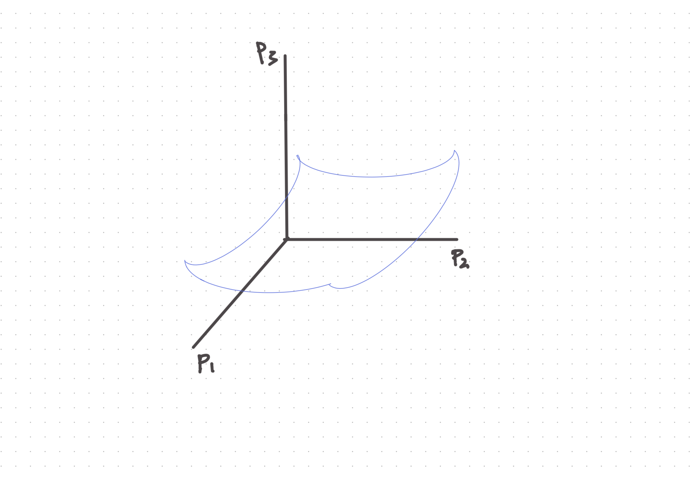

Information Theory and Statistical Mechanics
===============================================

.. admonition:: Jaynes, E. T. (1957)
   :class: important

   Jaynes, E. T. (1957) Information Theory and Statistical Mechanics. Physical Review, 106(4), 620–630. https://doi.org/10.1103/PhysRev.106.620

Line of Reasoning
-------------------

Jaynes pointed out in this paper that we are solving an insufficient reasoning problem. What we could measure is some macroscopic quantity, from which we derive other macroscopic quantities. That being said, we know a system with a lot of possible microscopic states, :math:`\{ s_i \}` while the probabilities of each microscopic state :math:`\{p_i \}` is not known at all. We also know a macroscopic quantity :math:`\langle f(s_i) \rangle` which is defined as

.. math::
   \langle f \rangle = \sum_i p_i f(s_i).

The question that Jaynes asked was the following.

**How are we supposed to find another macroscopic quantity that also depends on the microscopic state of the system?** Say :math:`g(s_i)`.

To visualize this problem, we know think of this landscape of the states. Instead of using the state as the dimensions, we use the probabilities as the dimensions since they are unknown. In the end, we have a coordinate system with each dimension as the value of the probabilities :math:`\{p_i\}` and the one dimension for the value of :math:`\langle g \rangle (p_i)` which depends on :math:`\{p_i\}`. Now we constructed a landscape of :math:`\langle g \rangle (p_i)`. The question is, how does our universe arrange the landscape? Where are we in this landscape if we are at equilibrium?

   Illustions.

.. admonition:: Crucial Problems
   :class: toggle

   In Jaynes' paper, he mentioned several crucial problems.

   1. Do we need to know the landscape formed by :math:`\{p_i\}` and :math:`\langle f(x_i)\rangle`? No.
   2. Do we need to find the exact location of our system? We have to.
   3. How? Using the max entropy principle.
   4. How to calculate another macroscopic quantity based on one observed macroscopic quantity and the conservation of probability density? Using the probabilities found in the previous step.
   5. Why does max entropy work from the information point of view? Assuming less about the system.
   6. Why is the result predicting measurements even the theory is purely objective? This shows how simple nature is. Going philosophical.
   7. With the generality of the formalism, what else can we do with it to improve our statistical mechanics power? Based on the information we know, we have different formalism of statistical physics.

The Max Entropy Principle
------------------------------------

The max entropy principle states that the distribution we choose for our model is based on the least information principle, i.e., largest Shannon entropy :math:`S_p`, or the distribution :math:`p(s)` should have the largest uncertainty, subject to the constraint that the theory should match the observations, i.e., :math:`\langle f\rangle_{t} = \langle f \rangle_o` where :math:`\langle f\rangle_{t}` denotes for theoretical result and :math:`\langle f \rangle_o` is the observation,

.. math::
   \langle f\rangle_{t} = \int \mathrm d s f(s) p(s).

We could have multiple constraints,

.. math::
   \langle f_i \rangle_{t} = \langle f_i \rangle_o,

if we have multiple observables.

.. admonition:: Shannon Entropy
   :class: toggle

   The Shannon entropy is

   .. math::
      S_p = -\mathrm{Tr}_s p(s) \log p(s).

The principle is an optimization problem with constraints. The constraint can be translated into the Lagrange multipliers. The cost function becomes

.. math::
   \mathcal L[p]  = - S_p + \sum_i \lambda_i \left( \langle f_i \rangle_o - \int \mathrm d s f_i(s) p(s) \right) + \gamma ( 1 - \int \mathrm d s p(s)),

where the last constraint accounts for the fact that :math:`p(s)` has to be a probability density.

Using variational method, we require :math:`\delta \mathcal L /\delta p = 0`,

.. math::
   \frac{\delta \mathcal L[p]}{\delta p} = \frac{-\delta S_p}{\delta p} - \sum_i \frac{\lambda_i \delta \langle f_i \rangle_t}{\delta p} - \frac{\gamma \delta \int \mathrm d s p(s)}{\delta p}.

The variation of the Shannon entropy is

.. math::
   \frac{-\delta S_p}{\delta p} = - \log p(s) - 1.

The variation of the theoretical expectation of the observable is

.. math::
   \frac{\delta \langle f_i \rangle_t}{\delta p} = \frac{ \delta \int \mathrm d s p(s) f_i(s) }{\delta p} = \f_i(s).

The variation of the total cost becomes

.. math::
   \frac{\delta \mathcal L}{\delta p} = \log p(s) + 1 - \lambda_i f_i(s) - \gamma =0.

The solution to this is

.. math::
   p \propto e^{\lambda_i f_i(s)}.

By normalizing it, we have the the Boltzmann distribution,

.. math::
   p = \frac{1}{Z}e^{\lambda_i f_i(s)},

where

.. math::
   Z = \int \mathrm d s e^{\lambda_i f_i(s)} = e^{\gamma -1}.

This leads to the

Is this related to mutual information?
-----------------------------------------

The idea is great. Let's expand it a bit.

Do we have a max mutual information principle instead of the max entropy principle? Somehow, we come up with an expression of the average of another quantity. What will happen from a landscape point of view?

If we construct these these two landscapes:

1. :math:`\langle f(x_i)\rangle` as a function of :math:`\{p_i\}`,
2. and :math:`\langle g(x_i)\rangle` as a function of :math:`\{p_i\}`.

Max mutual information indicates that the :math:`\{p_i\}` inferred from the two quantities should be the same. Huh, trivial.

Classical Balls on Chessboard
-------------------------------

.. entropy of actual chess plays

We can write down a function, which is the average of the balls.
