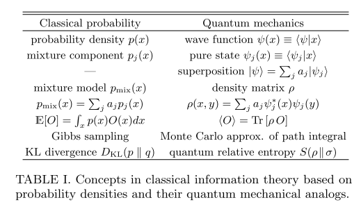

Information in Classical Theories and Quantum Theories
============================================================================

K. Cranmer et al summarized the classical information theory and quantum mechanics. [Cranmer2019]_

   From [Cranmer2019]_

References
-------------------

.. [Cranmer2019] Cranmer, K., Golkar, S., & Pappadopulo, D. (2019). Inferring the quantum density matrix with machine learning. Retrieved from http://arxiv.org/abs/1904.05903