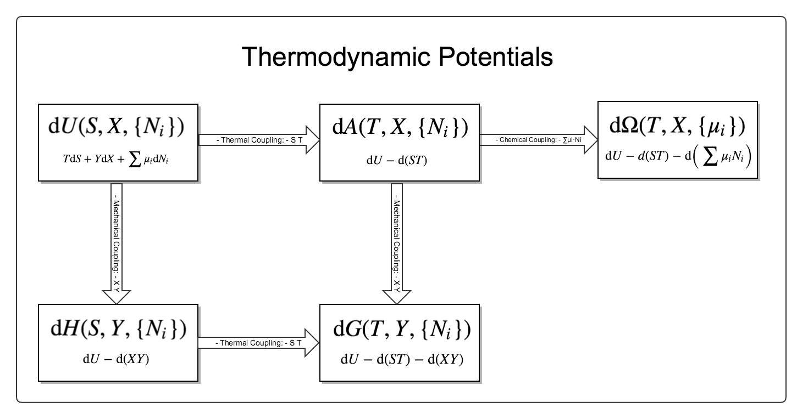

.. index:: Gaussian Integral, Special Functions

Vocabulary
===========

.. index:: Gaussian Integral

Gaussian Intergral
--------------------

.. math::

   \int_{-\infty}^{\infty} e^{-ax^2} \mathrm dx = \sqrt{\frac{\pi}{a}}

A comprehensive description of how this is done is `here <http://mathworld.wolfram.com/GaussianIntegral.html>`_.

Basicly, we just transform the problem to the :math:`\int e^{-x} \mathrm dx` problem.

Behavior of Functions
-----------------------

.. note::
   To see the true nature of graphs, make quantities dimensionless. This is also true for theoretical derivations. Dimensionless equations can reveal more.

0. Boltzmann factor

The most important and weirdest function in statmech

.. figure:: ../_static/voc/boltzfactor.png
   :align: center

   The nth derivative of this function is always 0 at x=0, for all finite n. Then how does it rise? The only thing I can say is that we are actually dealing with infinite n.

   Professor Kenkre: sleeping lion!

1. Tanh(x)

.. image:: ../_static/voc/tanh.jpg
   :align: center

2. :math:`1-exp(-x)`

.. image:: ../_static/voc/exp1.jpg
   :align: center

3. :math:`cosh(1/x)-1/x`

.. image:: ../_static/voc/cosh1.jpg
   :align: center

4. :math:`1/(1+1/x)`

.. image:: ../_static/voc/fraction1.jpg
   :align: center

.. note::

   An example of this :math:`1/(1+1/x)` is the modified gas model.

   .. math::
      P (V - b) = N k T

   We can find out :math:`1/V`, which is

   .. math::
      \frac{1}{V} = \frac{1}{b+\frac{N k T}{P}}

   Now we can plot out :math:`\frac{1}{V} ~ P` and it shows a behavior just like :math:`1/(1+1/x)`.

Fourier Transform
--------------------

Fourier transform for continuous equation is

.. math::
   \frac{\partial}{\partial x} e^{ikx}=ike^{ikx} &\implies \frac{\partial}{\partial x} \to ik \\
   \frac{\partial^2}{\partial x^2} e^{ikx} = -k^2 e^{ikx} & \implies \frac{\partial^2}{\partial x^2} \to -k^2

Laplace Transform
--------------------

Laplace transform is a transform of a function :math:`f(t)` to a function of :math:`s`,

.. math::
   L[f(t)] = \int_0^\infty f(t) e^{ - s t} dt .

Some useful properties:

1. :math:`L[\frac{d}{dt}f(t)] = s L[f(t)] - f(0)`;
2. :math:`L[\frac{d^2}{dt^2}f(t) = s^2 L[f(t)] - s f(0) - \frac{d f(0)}{dt} `;
3. :math:`L[\int_0^t g(\tau) d\tau ] = \frac{L[f(t)]}{s}`;
4. :math:`L[\alpha t] = \frac{1}{\alpha} L[s/\alpha]`;
5. :math:`L[e^{at}f(t)] = L[f(s-a)]`;
6. :math:`L[tf(t)] = - \frac{d}{ds} L[f(t)]`.

Some useful results:

1. :math:`L[1] = \frac{1}{s}`;
2. :math:`L[\delta] = 1`;
3. :math:`L[\delta^k] = s^k`;
4. :math:`L[t] = \frac{1}{s^2}`;
5. :math:`L[e^{at}]= \frac{1}[s-a]`.

A very nice property of Laplace transform is

.. math::
   L_s [e^{at}f(t)] &= \int_0^\infty e^{-st} e^{-at} f(t) dt \\
   & =  \int_0^\infty e^{-(s+a)t}f(t) dt \\
   & = L_{s+a}[f(t)]

which is very useful when dealing with master equations.

Two useful results are

.. math::
   L[I_0(2Ft)] = \frac{1}{\sqrt{ \epsilon^2 - (2F)^2 }}

and

.. math::
   L[J_0[2Ft]]  = \frac{1}{\sqrt{\epsilon^2 + (2F)^2}},

where :math:`I_0(2Ft)` is the modified Bessel functions of the first kind. :math:`J_0(2Ft)` is its companion.

Using the property above, we can find out

.. math::
   L[I_0(2Ft)e^{-2Ft}]  = \frac{1}{\sqrt{(\epsilon + 2F)^2 - (2F)^2}} .

Functions that will saturate
----------------------------

.. math::
   1-e^{-\alpha x}
   \tanh(x)
   \cosh(\frac{1}{x}) - \frac{1}{x}

.. _legendre-transform:

Legendre Transform
-------------------------

The geometrical of physical meaning of Legendre transformation in thermodynamics can be illustrated by the following graph.

.. image:: images/LegendreTransform.png
   :alt: Legendre Transform made clear
   :width: 80%

For example, we know that entropy :math:`S` is actually a function of temperature :math:`T`. For simplicity, we assume that they are monotonically related like in the graph above. When we are talking about the quantity :math:`T \mathrm d S` we actually mean the area shaded with blue grid lines. Meanwhile the area shaded with orange line means :math:`S \mathrm d T`.

Let's think about the change in internal energy which only the thermal part are considered here, that is,

.. math::
   \mathrm d U = T \mathrm d S  .

So internal energy change is equal to the the area shaded with blue lines. Now think about a three dimensional graph with a third axis of internal energy which I can't show here. Notice that the line of internal energy is on the plane which is vertical to :math:`{T, S}` plane and contains the line black line in the graph above. The change of internal energy with an increase of :math:`\mathrm dS` is the value that the line of internal energy goes up.

Now we do such a transform that we actually remove the internal energy from :math:`\mathrm d ( T S )`, which finally gives us Helmholtz free energy,

.. math::
   \mathrm d A = S \mathrm d T .

It's obvious that after this Legendre transform, the new area is the part shaded with orange lines.

Now the key point is that :math:`S(T)` is a function of :math:`T`. So if we know the blue area then we can find out the orange area, which means that the two function :math:`A(T)` and :math:`U(S)` are identical. Choosing one of them for a specific calculation is a kind of freedom and won't change the final results.

--------------

--------------

Thermodynamics
-----------------

Thermodynamics is about the desciption of large systems which is mostly about the following keypoints. (*A Modern Course in Statistical Physics* by L. E. Reichl)

1. Thermodynamic variables; extensive, intensive, neither;
2. Equations of state;
3. Four fundamental laws of thermodynamics;
4. Thermodynamics potentials
5. Phase transitions
6. Response
7. Stability

Anyway, thermodynamics is a kind of theory that deals with black boxes. We manipulate any variables we like and look at the changes. Then we summarize and get a set of laws.

.. index:: Laws of Thermodynamics

The Laws of Four
~~~~~~~~~~~~~~~~~~~

.. admonition:: Laws

   **Zeroth** Law: A first feeling about temperature

   Two bodies, each in thermodynamic equilibrium with a third system, are in thermodynamic equilibirum with each other.

   This gives us the idea that there is a universal quantity which depends only on the state of the system no matter what they are made of.

.. admonition:: Laws

   **First** Law: Conservation of energy

   Energy can be transfered or transformed, but can not be destroyed.

   In math,

   .. math::
      \mathrm d U  = W + Q

   where :math:`W` is the energy done to the system, :math:`Q` is the heat given to the system. A better way to write this is to make up a one-form :math:`\Omega`,

   .. math::
      \mathbf\Omega \equiv \mathbf d U  - W - Q =0

   Using Legendre transformation, we know that this one form have many different formalism

.. admonition:: Laws

   **Second** Law: Entropy change; Heat flow direction; Efficieny of heat engine

   There are three different versions of this second law. Instead of statements, I would like to use two inequalities to demonstrate this law.

   .. math::
      \eta = \frac{\Delta W}{\Delta Q} \le 1

   For isolated systems,

   .. math::
      \mathrm d S \ge 0

   Combine second law with first law, for reversible systems, :math:`W = T\mathbf {\mathrm d} S`, then for ideal gas

   .. math::
      \mathbf\Omega \equiv \mathbf d U  - T \mathbf  d S + p \mathbf d V =0

   Take the exterior derivative of the whole one-form, and notice that :math:`U` is exact,

   .. math::
      -\frac{\partial T}{\partial V}\vert_S \mathbf d V \wedge \mathbf d S + \frac{\partial p}{\partial S}\vert_S \mathbf d S \wedge \mathbf d V = 0

   Clean up this equation we will get one of the Maxwell relations. Use Legendre transformation we can find out all the Maxwell relations.

.. index:: Second Definition of Temperature, Thermodynamic Temperature

   .. hint::

      Second definition of temperature comes out of the second law. By thinking of two reversible Carnot heat engines, we find a funtion depends only a parameter which stands for the temperature like thing of the systems. This defines the **thermodynamic temeprature**.

.. admonition:: Laws

   **Third** Law: Abosoulte zero; Not an extrapolation; Quantum view

   The difference in entropy between states connected by a reserible process goes to zero in the limit :math:`T\rightarrow 0 K`.

   Due to the asymptotic behavior, one can not get to absolute zero in a finite process.

.. index:: Thermodynamic Potentials

.. _thermodynamical-potentials:

Thermodynamic Potentials
~~~~~~~~~~~~~~~~~~~~~~~~~~~

1. Internal Energy
2. Enthalpy
3. Helmholtz Free Energy
4. Gibbs Free Energy
5. Grand Potential

The relations between them? All potentials are Legendre transformation of each other. To sum up, let's gliffy.

(The gliffy source file is `here <images/thermodynamicPotentials.gliffy>`_ . Feel free to download and create your own version.)

This graph needs some illustration.

1. Legendre transformation: :math:`ST-U(S)` transform a funcion :math:`U(S)` with variable :math:`S` to another function :math:`H(T)`. However, in thermodynamics use the different sign can be more convinient. In other words, :math:`U(S)` and :math:`-H(T)` are dual to each other.
2. Starting from this graph, we can find out the differentials of thermodynamic potentials. Next take the partial derivatives of thermodynamic potential with respect to their own variables. By comparing the partial derivatives and the definitions of them, we find out expressions of their vairables. Finally different expressions for the same variable are equal, which are the Maxwell relations.
3. As we have seen in 2, all the thermodynamic quantities can be obstained by taking the derivatives of thermodynamic potentials.

.. hint::
   **Question:** Mathematically we can construct the sixth potential namely the one that should appear at the right bottom of the graph. Why don't people talk about it?

   We can surely define a new potential called :math:`Null(T,X,\{\mu_i\})`. However, the value of this function is zero. So we can have the derivitive of this potential is also zero. This is the Gibbs Duhem equation.

   The answer I want to hear is that this is something :math:`\mathrm d\mathrm d f = 0` where f is exact.

.. hint::
   **Question**: Why is internal energy :math:`U` a function of three extensive quantities, :math:`V`, :math:`S`, :math:`N`?

   There are three aspects to be considered.

.. index:: Entropy

The Entropy
~~~~~~~~~~~~~~~~~

When talking about entropy, we need to understand the properties of cycles. The most important one is that

.. math::
   \sum_{i=1}^n \frac{Q_i}{T_i} \leq 0

where the equality holds only if the cycle is reversible for the set of processes. In another sense, if we have infinitesimal processes, the equation would have become

.. math::
   \oint \frac{\mathrm d Q}{T} = 0 .

The is an elegent result. It is intuitive that we can build correspondence between one path between two state to any other paths since this is a circle. That being said, the following integral

.. math::
   \int_A^B \frac{\mathrm d Q}{T},

is independent of path on state plane. We imediately define :math:`\int_A^B \frac{\mathrm d Q}{T}` as a new quantity because we really like invariant quantities in physics, i.e.,

.. math::
   S(B) - S(A) = \int_A^B \frac{\mathrm d Q}{T},

which we call entropy (difference). It is very important to realize that entropy is such a quantity that only dependents on the initial and final state and is independent of path. Many significant results can be derived using only the fact that entropy is a function of state.

1. Adiabatic processes on the plane of state never go across each other. Adiabatic lines are isoentropic lines since :math:`\mathrm dS = \frac{\mathrm dQ}{T}` as :math:`\mathrm dQ = 0` gives us :math:`\mathrm dS = 0`. The idea is that at the crossing points of adiabatic lines we would get a branch for entropy which means two entropy for one state.
2. No more than one crossing point of two isothermal lines is possible. To prove it we need to show that entropy is a monotomic equation of :math:`V`.
3. We can extract heat from one source that has the same temperature and transform into work if the isoentropic lines can cross each other which is not true as entropy is quantity of state. Construct a system with a isothermal line intersects two crossing isoentropic lines.
4. We can extract heat from low temperature source to high temperature source without causing any other results if we don't have entropy as a quantity of state.

Irreversiblity
------------------

1. some discussion here. :ref:`irreversiblity`

This problem can be understood by thinking of the statistics. Suppose we have a box and N gas molecules inside. We divide it into two parts, left part and right part. At first all the particles are in the L part. As time passing by the molecules will go to the R part.

The question we would ask is what the probablity would be if all the particles comes back to the L part. By calculation we can show that the ratio :math:`R` of number of particles on L part and R part,

.. math::
   R = \frac{N_L}{N-N_R},

will have a high probability to be 0.5, just as fascinating as central limit theorem.

Refs & Note
------------------
